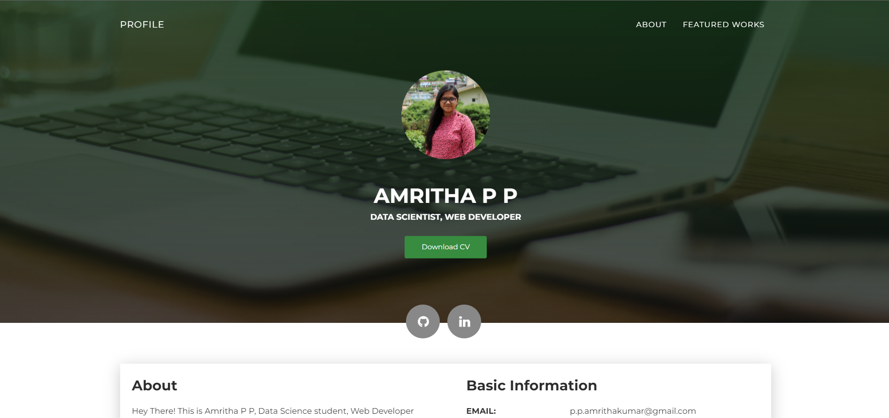
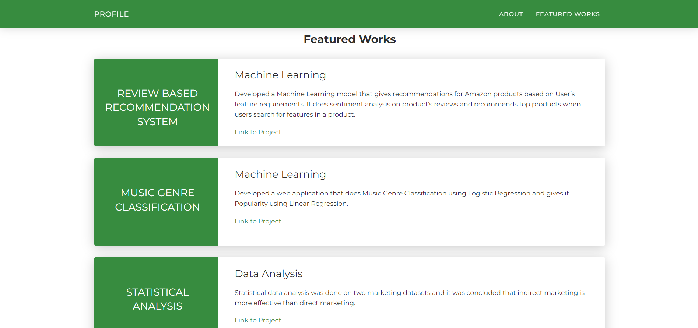

# Profile

A Personal Portfolio Website

This project is a personal portfolio website that showcases my about me and my featured works. It provides a brief detail about my experience and skillset in web development, data science, and machine learning.

Here's a live deployment - https://amritha-07.github.io/Profile/

<center>
    
</center>

<center>
    
</center>

## Tech-Stack

- HTML
- CSS
- JavaScript

## Installation and Usage

To install and run this project, you need to have a web browser (such as Chrome or Firefox) that supports HTML, CSS, and JavaScript.

To download the code and assets for this project, you can clone this GitHub repository using the following command:

```git clone https://github.com/Amritha-07/Profile.git```
